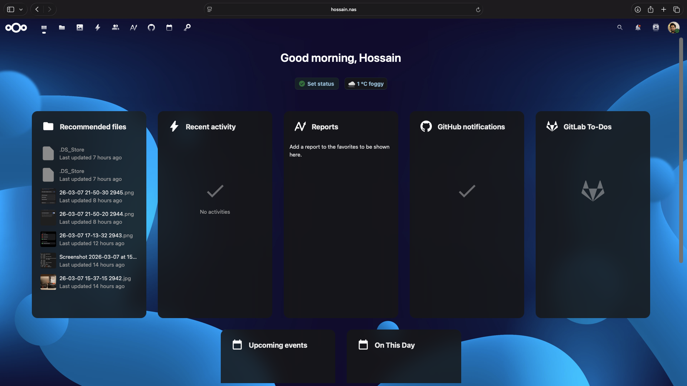
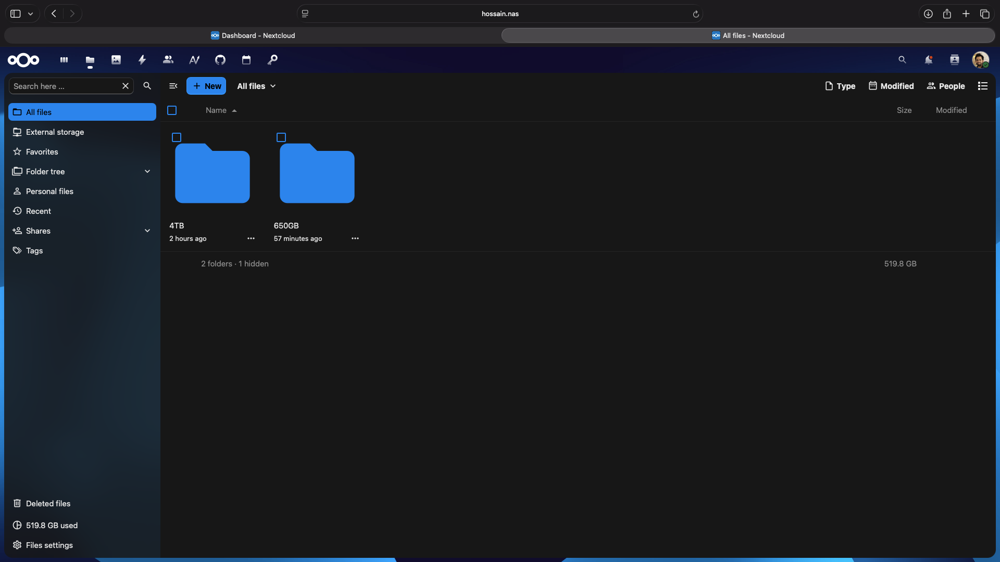
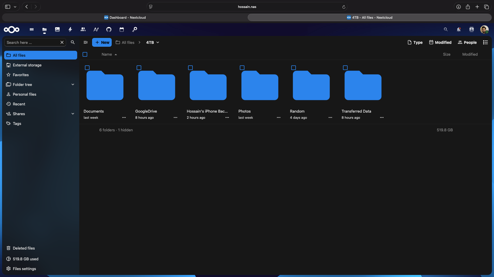
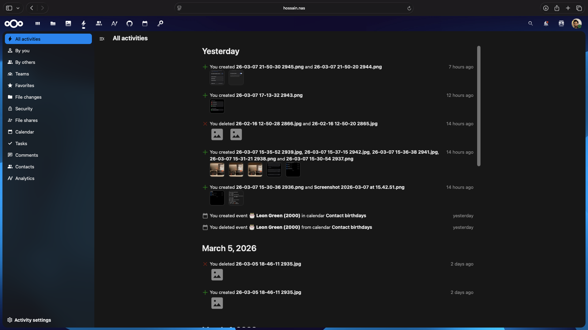
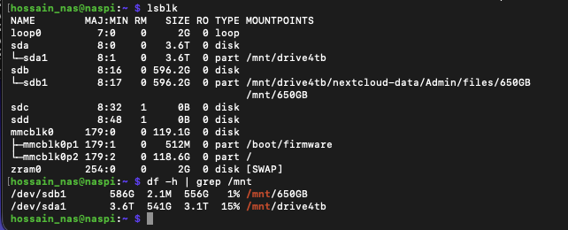
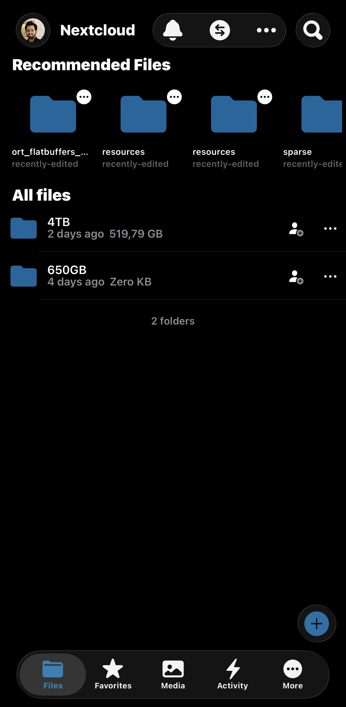
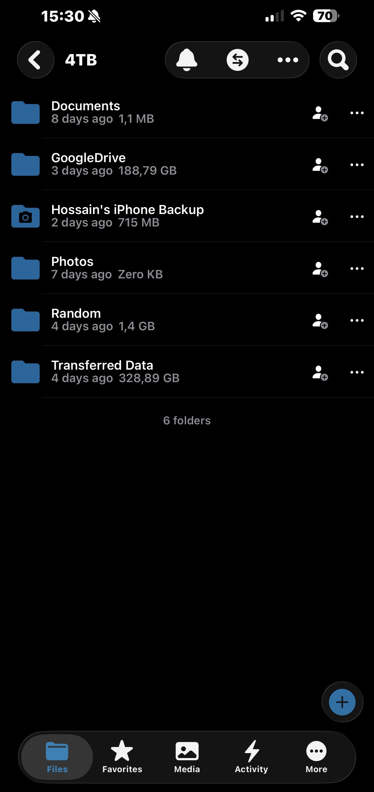
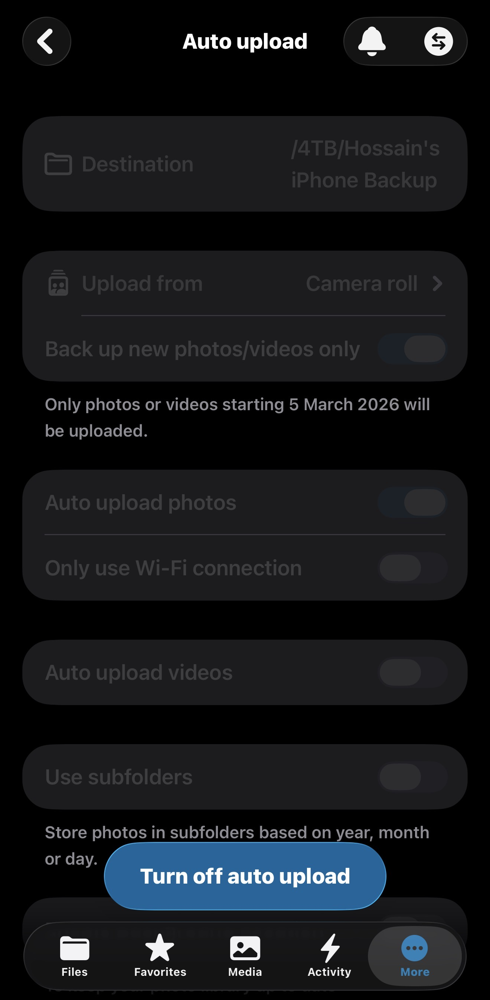

<div align="center">

# 🖥️ Raspberry Pi 4 — NAS Storage Server

**A fully working self-hosted NAS (Network Attached Storage) server built from scratch — headless setup, no monitor, no keyboard required.**

[](https://www.raspberrypi.com/)
[](https://www.raspberrypi.com/software/)
[](https://nextcloud.com/)
[](https://www.samba.org/)
[](https://tailscale.com/)
[](.)

<br>

> **Your private Google Drive — running on your own hardware, accessible from anywhere in the world, secured by VPN.**

<br>


</div>

---

## 📖 What Is This Project?

This is a **complete, real-world NAS (Network Attached Storage) server** built using a Raspberry Pi 4 and two hard drives — a 4TB Seagate IronWolf and a 650GB laptop HDD — connected via a RSHTECH USB 3.0 docking station.

The server runs three services together:
- **Nextcloud** — private cloud storage, accessible from any browser or app, anywhere in the world
- **Samba** — makes your drives appear as normal network folders in Finder, Windows Explorer, and iPhone Files app
- **Tailscale VPN** — secure encrypted access from anywhere, with no port forwarding required

Everything was built, tested, and documented from scratch. Every real-world error encountered during setup is solved and documented.

---

## ✅ Features

| Feature | Details |
|---|---|
| 🌐 Private cloud storage | Access files from any browser, anywhere in the world |
| 🔒 Secure VPN access | Tailscale WireGuard tunnel — no port forwarding needed |
| 📱 All devices supported | MacBook, iPhone, Android, Windows — all fully configured |
| 📷 Auto photo backup | iPhone and Android photos sync automatically to NAS |
| 🗂️ Samba file sharing | Drives appear as normal network folders on all devices |
| 🔁 Zero file duplication | Nextcloud and Samba access the exact same files |
| ☁️ Google Drive sync | Nightly automatic sync from Google Drive to NAS |
| ⏱️ Auto file scanning | Files added via Samba appear in Nextcloud within 5 minutes |
| 💾 Weekly config backup | All config files backed up automatically every Sunday |
| 🏥 SMART health monitoring | Weekly drive health report saved automatically |
| 📧 Email health alerts | Email sent only when a problem is detected |
| 🔄 Auto crash recovery | Nextcloud, Samba, Redis restart within 10 seconds if they crash |
| 🛡️ Firewall protection | UFW configured with minimal open ports |
| 📌 Static IP | Pi IP never changes after reboot — DHCP reservation |
| ⚡ nofail drive mounts | Pi boots safely even if a drive is disconnected |

---

## 🖼️ Screenshots

<table>
<tr>
<td align="center">
<br>
<b>Nextcloud Dashboard</b><br>
<sub>Accessible from any browser</sub>
</td>
<td align="center">
<br>
<b>Both Drives Visible</b><br>
<sub>4TB and 650GB as folders</sub>
</td>
</tr>
<tr>
<td align="center">
<br>
<b>4TB Drive Contents</b><br>
<sub>519 GB of real data</sub>
</td>
<td align="center">
<br>
<b>Activity Log</b><br>
<sub>Automatic file tracking</sub>
</td>
</tr>
<tr>
<td align="center">
<br>
<b>Drives Mounted</b><br>
<sub>lsblk and df -h output</sub>
</td>
<td align="center">
<br>
<b>iPhone Nextcloud App</b><br>
<sub>Both drives on iPhone</sub>
</td>
</tr>
<tr>
<td align="center">
<br>
<b>iPhone — 4TB Contents</b><br>
<sub>All folders accessible</sub>
</td>
<td align="center">
<br>
<b>iPhone Auto Upload</b><br>
<sub>Automatic photo backup</sub>
</td>
</tr>
</table>

---

## 🔧 Hardware Used

| Component | Specification |
|---|---|
| **Single Board Computer** | Raspberry Pi 4 Model B |
| **OS Storage** | 128GB microSD card |
| **Primary HDD** | 4TB Seagate IronWolf 3.5" NAS HDD (new) |
| **Secondary HDD** | 650GB 2.5" Laptop HDD (older, personal drive) |
| **HDD Dock** | RSHTECH USB 3.0 HDD Docking Station |
| **Power Supply** | Official Raspberry Pi USB-C 5.1V 3A |
| **Network** | WiFi (setup done via WiFi — Ethernet also fully supported) |

> **📝 About the HDD setup:** This project uses two personal HDDs that were already available — a new 4TB Seagate IronWolf as the primary storage drive and an older 650GB laptop HDD as a secondary volume. Both drives are connected via a single USB 3.0 docking station and serve as independent storage volumes.
>
> This **is** a NAS (Network Attached Storage) setup — all files are accessible over the network from any device, anywhere in the world. However, this is **not** a RAID NAS. In a traditional RAID NAS, two same-size drives mirror each other so that if one drive fails, no data is lost. In this setup, each drive is independent — if a drive fails, the files on that drive are lost. For best results and redundancy, using two same-size drives in RAID is recommended. Since this project uses personal drives of different sizes, separate backups of critical data should always be maintained.

---

## 🛠️ Software Stack

| Software | Version | Purpose |
|---|---|---|
| Raspberry Pi OS Lite 64-bit | Bookworm | Operating system |
| Nextcloud | Latest | Private cloud — Google Drive alternative |
| Apache2 | 2.4 | Web server for Nextcloud |
| PHP | 8.3 | Runtime for Nextcloud |
| MariaDB | Latest | Database for Nextcloud |
| Redis | Latest | Cache and file locking |
| Samba | Latest | SMB file sharing — all devices |
| Tailscale | Latest | Zero-config VPN — global access |
| UFW | Latest | Firewall |
| rclone | Latest | Google Drive sync tool |
| smartmontools | Latest | HDD health monitoring |
| unattended-upgrades | Latest | Automatic security updates |

---

## 🌐 Network Architecture

```
┌──────────────────────────────────────────────────────────┐
│                     HOME NETWORK                          │
│                                                           │
│  ┌──────────┐   WiFi    ┌────────────────────────────┐   │
│  │  Router  │◄─────────►│      Raspberry Pi 4        │   │
│  └──────────┘          │   IP: YOUR_LOCAL_IP         │   │
│                        │   Hostname: naspi            │   │
│                        │                             │   │
│                        │  ┌──────────┐ ┌──────────┐  │   │
│                        │  │  4TB HDD │ │ 650GB HDD│  │   │
│                        │  │/mnt/drive│ │/mnt/650GB│  │   │
│                        │  │   4tb    │ │          │  │   │
│                        │  └──────────┘ └──────────┘  │   │
│                        └────────────────────────────┘   │
└──────────────────────────────────────────────────────────┘
                                │
                      Tailscale VPN Tunnel
                     (WireGuard encrypted)
                                │
         ┌──────────────────────┼──────────────────────┐
         │                      │                      │
  ┌──────▼──────┐      ┌────────▼──────┐      ┌───────▼──────┐
  │   MacBook   │      │    iPhone     │      │  Windows PC  │
  │  (anywhere) │      │  (anywhere)   │      │  (anywhere)  │
  └─────────────┘      └───────────────┘      └──────────────┘

  Global Tailscale IP: YOUR_TAILSCALE_IP  (permanent — never changes)
```

---

## 📚 Complete Setup Guide

The full setup guide is split into separate documents — one for each part. Click any link below to open that section.

| # | Guide | What it covers |
|---|---|---|
| 0 | [SSH Access](docs/00-ssh-access.md) | How to connect to Pi from MacBook, iPhone, Android, Windows |
| 1 | [OS Installation](docs/01-os-installation.md) | Flash Raspberry Pi OS, WiFi headless setup, first boot |
| 2 | [HDD Setup](docs/02-hdd-setup.md) | Connect drives, format, UUID mounting, fstab configuration |
| 3 | [Nextcloud Setup](docs/03-nextcloud-setup.md) | Apache, PHP 8.3, MariaDB, Redis, full Nextcloud installation |
| 4 | [Tailscale VPN](docs/04-tailscale-vpn.md) | Install VPN, global access, disable key expiry, all devices |
| 5 | [Samba Setup](docs/05-samba-setup.md) | SMB file sharing for MacBook, iPhone, Windows, Android |
| 6 | [File Access](docs/06-file-access.md) | How to access files from every device and location |
| 7 | [File Transfer](docs/07-file-transfer.md) | How to copy files to NAS from every device |
| 8 | [Security](docs/08-security.md) | UFW firewall, automatic security updates |
| 9 | [Troubleshooting](docs/09-troubleshooting.md) | All common errors — causes and fixes |
| 10 | [Quick Reference](docs/10-quick-reference.md) | All addresses, passwords, paths, commands in one place |
| 11 | [Daily Use](docs/11-daily-use.md) | Safe shutdown, startup, auto-restart services |
| 12 | [Crash Troubleshooting](docs/12-crash-troubleshooting.md) | Unexpected shutdowns, logs, temperature, power |
| 13 | [Google Drive Sync](docs/13-google-drive-sync.md) | Transfer all Google Drive files directly to NAS |
| 14 | [Automation](docs/14-automation.md) | 7 automatic tasks — backup, health, sync, alerts |

---

## ⚡ Quick Access Reference

### Access Addresses

| Device | Home WiFi | Global (Tailscale ON) |
|---|---|---|
| Any browser — Nextcloud | `http://YOUR_LOCAL_IP/nextcloud` | `http://YOUR_TAILSCALE_IP/nextcloud` |
| MacBook Finder — Samba | `smb://YOUR_LOCAL_IP` | `smb://YOUR_TAILSCALE_IP` |
| iPhone Files app — Samba | `smb://YOUR_LOCAL_IP` | `smb://YOUR_TAILSCALE_IP` |
| Android CX File Explorer | `YOUR_LOCAL_IP` | `YOUR_TAILSCALE_IP` |
| Windows File Explorer | `\\YOUR_LOCAL_IP\4TB` | `\\YOUR_TAILSCALE_IP\4TB` |
| SSH | `ssh YOUR_SSH_USERNAME@YOUR_LOCAL_IP` | `ssh YOUR_SSH_USERNAME@YOUR_TAILSCALE_IP` |

### Essential Commands

```bash
df -h | grep /mnt                    # Check how full your drives are
lsblk                                # See all connected drives
sudo systemctl status apache2        # Is Nextcloud running?
sudo systemctl status smbd           # Is Samba running?
sudo systemctl status redis-server   # Is Redis running?
tailscale status                     # Is VPN connected?
sudo reboot                          # Restart Pi safely
sudo shutdown -h now                 # Shut Pi down safely
```

### Safe Shutdown Order

```
1. ssh YOUR_SSH_USERNAME@YOUR_LOCAL_IP
2. sudo shutdown -h now
3. Wait 30 seconds — watch green LED go OFF
4. Turn off RSHTECH dock power switch
```

### Safe Startup Order

```
1. Turn ON dock power switch → wait 10 seconds
2. Connect Pi USB-C power cable
3. Wait 60–90 seconds for full boot
4. Open browser → http://YOUR_LOCAL_IP/nextcloud
```

---

## 🗂️ Repository Structure

```
raspberry-pi-nas-server/
│
├── README.md                  ← This file — project overview and quick reference
│
├── images/                    ← All setup and result screenshots
│   ├── hardware-hdd-dock.jpg
│   ├── nextcloud-dashboard.png
│   ├── nextcloud-files-both-drives.png
│   ├── nextcloud-4tb-contents.png
│   ├── nextcloud-activity-log.png
│   ├── terminal-drives-mounted.png
│   ├── iphone-nextcloud-drives.jpg
│   ├── iphone-nextcloud-4tb.jpg
│   └── iphone-auto-upload.jpg
│
├── config/                    ← Ready-to-use configuration files
│   ├── smb.conf               ← Samba configuration
│   ├── nextcloud.conf         ← Apache virtual host config
│   └── fstab                  ← Drive mount configuration
│
├── scripts/                   ← Automation bash scripts
│   ├── nas-backup-config.sh   ← Weekly config backup
│   ├── nas-drive-health.sh    ← Weekly SMART health check
│   ├── nas-gdrive-sync.sh     ← Nightly Google Drive sync
│   ├── nas-db-optimize.sh     ← Weekly database optimization
│   └── nas-health-alert.sh    ← 6-hourly email health alert
│
└── docs/                      ← Full step-by-step setup guides
    ├── 00-ssh-access.md
    ├── 01-os-installation.md
    ├── 02-hdd-setup.md
    ├── 03-nextcloud-setup.md
    ├── 04-tailscale-vpn.md
    ├── 05-samba-setup.md
    ├── 06-file-access.md
    ├── 07-file-transfer.md
    ├── 08-security.md
    ├── 09-troubleshooting.md
    ├── 10-quick-reference.md
    ├── 11-daily-use.md
    ├── 12-crash-troubleshooting.md
    ├── 13-google-drive-sync.md
    └── 14-automation.md
```

---

## 💡 Skills Demonstrated

- **Linux System Administration** — Raspberry Pi OS, systemd, cron, UFW firewall, fstab, persistent logging
- **Self-hosted Cloud Infrastructure** — Nextcloud, Apache, PHP 8.3, MariaDB, Redis cache
- **Network Configuration** — Tailscale VPN, Samba SMB, DHCP reservation, headless server setup (WiFi and Ethernet)
- **Security** — Firewall rules, WireGuard encryption, Redis file locking, automatic security updates
- **Automation & Scripting** — Bash scripting, cron scheduling, background processing, log management
- **Storage Management** — HDD formatting, UUID-based mounting, bind mounts, SMART health monitoring
- **Cross-platform Access** — macOS, iOS, Android, Windows — all configured simultaneously
- **Cloud Integration** — Google Drive migration via rclone, background transfers, nightly sync
- **Troubleshooting** — Real-world errors documented with root cause and tested fixes

---

<div align="center">

**Built by Md Motaher Hossain Bhuiyan**

*Self-hosted NAS infrastructure — fully designed, built, configured, automated, and documented from scratch.*
*Real-world production setup in Sweden — every error encountered is solved and documented.*

</div>
